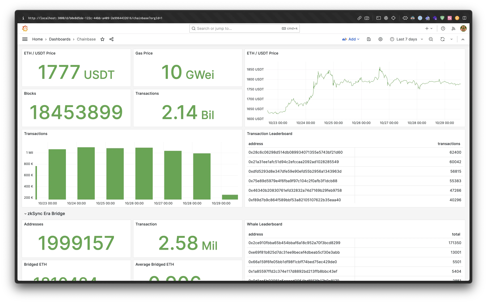
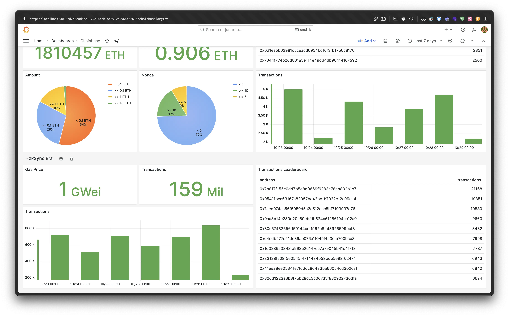
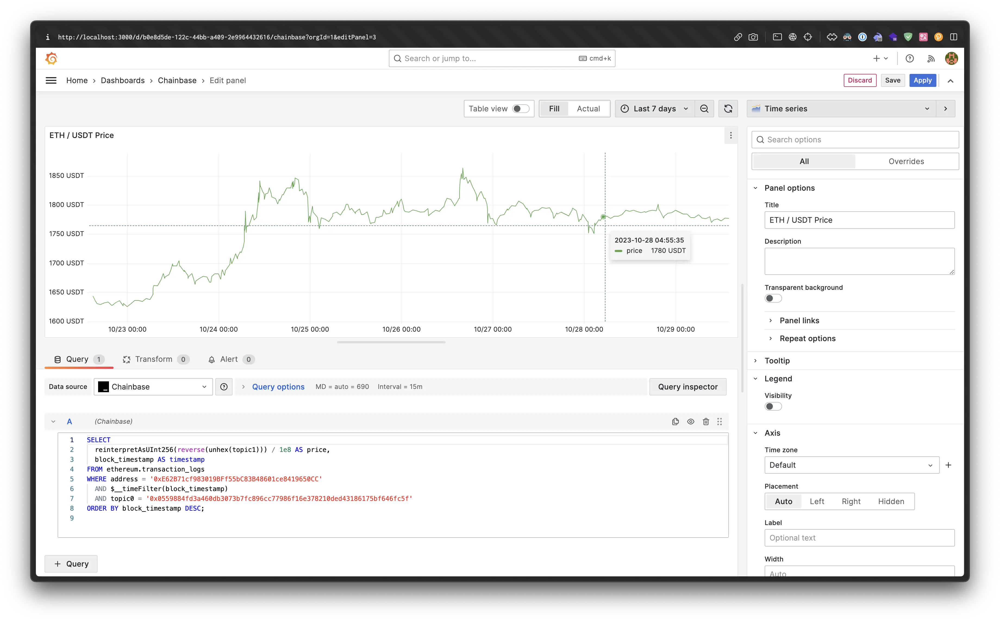

# Chainbase data source for Grafana


Grafana datasource plugin for the [Chainbase](https://chainbase.com/) SQL API.

## Screenshots





## Build

Build frontend and backend of the plugin.

```bash
pnpm build
mage -v
```

## Roadmap

- [ ] Enhanced query features
  - [ ] SQL query builder
  - [ ] SQL macros support

## License

[Mozilla Public License 2.0](LICENSE)
